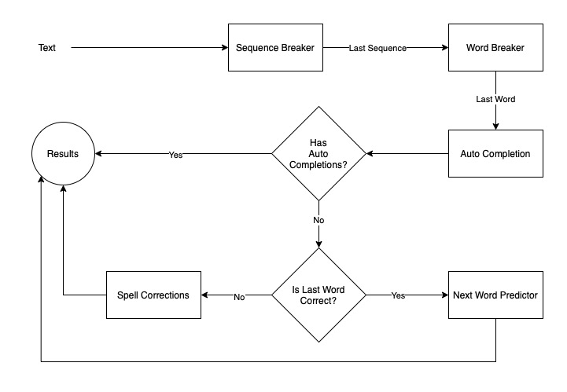

# AKARA Android - Multi-Language Word Suggestions Toolkit for Android
The AKARA (អក្ខារា) project aims to give developers the power to easily add multi-language word suggestions support to their applications. AKARA Android brings this goal to life for Android developers.

## Language Support
- [x] Khmer
- [x] English

## Word Suggestions Approach


# Installing
###  Step 1. Add the JitPack repository to your build file
```gradle
allprojects {
    repositories {
        ...
        maven { url 'https://jitpack.io' }
    }
}
```

### Step 2. Add the dependency
```gradle
dependencies {
    implementation 'com.github.Socret360:akara-android:Tag'
}
```

### Step 3. Use the package
```Kotlin
class MainActivity : AppCompatActivity() {
    lateinit var akara: Akara

    override fun onCreate(savedInstanceState: Bundle?) {
        super.onCreate(savedInstanceState)
        setContentView(R.layout.activity_main)

        akara = Akara(this)

        val sentence = "ឯងនេះមួយយប់ៗដេកខ្វល់រឿងអនាគតមិនដឹងធ្វើអីចិញ្ចឹមខ្លួនមួយនេះរស់"

        akara.suggest(input, object: OnSuggestionListener {
            override fun onCompleted(
                suggestionType: SuggestionType?,
                suggestions: List<String>,
                sequences: List<Sequence>,
                words: List<String>
            ) {
                Log.d(TAG, "input: $input")
                Log.d(TAG, "sequences: $sequences")
                Log.d(TAG, "words: $words")
                Log.d(TAG, "suggestions: ${suggestions.take(3)}")
                Log.d(TAG, "suggestion_type: $suggestionType")
                Log.d(TAG, "======")
            }

            override fun onError() {
                Log.d(TAG, "$input: Cannot provide suggestions")
            }
        })
    }
}
```

# Credits
### Sequence Breaker:
- Using simple space splitting and MLKit to determine sequence language.

### WordBreaker:
- Khmer: Deep Learning (LSTM) based on [Joint Khmer Word Segmentation and Part-of-Speech Tagging Using Deep Learning](https://arxiv.org/abs/2103.16801) from [https://github.com/Socret360/joint-khmer-word-segmentation-and-pos-tagging](https://github.com/Socret360/joint-khmer-word-segmentation-and-pos-tagging).
- English: Simple space spliting.

### Auto Completion
- Khmer: Prefix Tree (a.k.a Trie) with dictionaries from [https://github.com/sbbic/khmerlbdict](https://github.com/sbbic/khmerlbdict).
- English: Prefix Tree (a.k.a Trie) with dictionary from [https://github.com/dwyl/english-words](https://github.com/dwyl/english-words).

### Spell Checker / Corrections
- Khmer: BK Tree with dictionaries from [https://github.com/sbbic/khmerlbdict](https://github.com/sbbic/khmerlbdict).
- English: BK Tree with dictionaries from [https://github.com/derekchuank/high-frequency-vocabulary](https://github.com/derekchuank/high-frequency-vocabulary).

### Next Word Suggestions
- Khmer: Deep Learning (LSTM) trained by [@ssokhavirith](https://github.com/ssokhavirith?tab=repositories).
- English: N/A

# Want to Help?

Code contributions are welcome for this project and other AKARA related projects.

| Project        | Status           | URL  |
| ------------- |:-------------:| -----:|
| akara-android      | Active | https://github.com/Socret360/akara-android |
| akara-ios      | Active      |   https://github.com/Socret360/akara-ios |
| akara-web | TBC      ||

# License
The MIT License (MIT)

Copyright (c) 2015 SIL NRSI

Permission is hereby granted, free of charge, to any person obtaining a copy
of this software and associated documentation files (the "Software"), to deal
in the Software without restriction, including without limitation the rights
to use, copy, modify, merge, publish, distribute, sublicense, and/or sell
copies of the Software, and to permit persons to whom the Software is
furnished to do so, subject to the following conditions:

The above copyright notice and this permission notice shall be included in all
copies or substantial portions of the Software.

THE SOFTWARE IS PROVIDED "AS IS", WITHOUT WARRANTY OF ANY KIND, EXPRESS OR
IMPLIED, INCLUDING BUT NOT LIMITED TO THE WARRANTIES OF MERCHANTABILITY,
FITNESS FOR A PARTICULAR PURPOSE AND NONINFRINGEMENT. IN NO EVENT SHALL THE
AUTHORS OR COPYRIGHT HOLDERS BE LIABLE FOR ANY CLAIM, DAMAGES OR OTHER
LIABILITY, WHETHER IN AN ACTION OF CONTRACT, TORT OR OTHERWISE, ARISING FROM,
OUT OF OR IN CONNECTION WITH THE SOFTWARE OR THE USE OR OTHER DEALINGS IN THE
SOFTWARE.